# DESPLIEGUE — Evidencias y respuestas

---

## Pasos previos

### 1. Abrir Docker Desktop
Antes de empezar, abrimos **Docker Desktop** desde el menú de inicio de Windows. Esperamos a que el icono de la ballena en la barra de tareas indique que está corriendo.

### 2. Abrir Git Bash
Abrimos **Git Bash** desde el menú de inicio. Esta será nuestra terminal para ejecutar todos los comandos.

### 3. Crear la carpeta del proyecto
```bash
mkdir ~/nginx-practica
cd ~/nginx-practica
```

### 4. Clonar las webs que vamos a usar
```bash
git clone https://github.com/cloudacademy/static-website-example webs-principal
git clone https://github.com/ArchiDep/static-clock-website webs-reloj
```

### 5. Crear el archivo docker-compose.yml
```bash
cat > docker-compose.yml << 'EOF'
services:
  nginx:
    image: nginx:latest
    container_name: nginx-web
    ports:
      - "8080:80"
      - "8443:443"
    volumes:
      - web-content:/usr/share/nginx/html
      - ./default.conf:/etc/nginx/conf.d/default.conf
      - ./certs:/etc/ssl/certs/nginx
    depends_on:
      - sftp
    restart: unless-stopped

  sftp:
    image: atmoz/sftp
    container_name: sftp-server
    ports:
      - "2222:22"
    volumes:
      - web-content:/home/usuario/upload
    command: usuario:password:1001
    restart: unless-stopped

volumes:
  web-content:
EOF
```

### 6. Crear el archivo default.conf inicial (sin HTTPS)
```bash
cat > default.conf << 'EOF'
server {
    listen 80;
    server_name localhost nombre_web;

    root /usr/share/nginx/html;
    index index.html index.htm;

    location / {
        try_files $uri $uri/ =404;
    }
}
EOF
```

### 7. Levantar los contenedores por primera vez
```bash
docker compose up -d
```

### 8. Verificar que los contenedores están corriendo
```bash
docker compose ps
```

---

## Parte 1 — Evidencias mínimas.

### Fase 1: Instalación y configuración.

#### 1. Servicio Nginx activo:
- **Qué demuestra:** El servidor web Nginx está instalado y corriendo dentro del contenedor Docker.
- **Comando:** `docker compose ps`


#### 2. Configuración cargada:
- **Qué demuestra:** El archivo de configuración personalizado `default.conf` está correctamente montado en `/etc/nginx/conf.d/`.
- **Comando:** `docker exec nginx-web ls -l /etc/nginx/conf.d/`

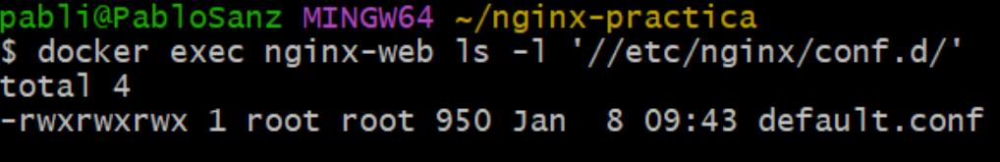

#### 3. Resolución de nombres:
- **Qué demuestra:** Se ha configurado el archivo hosts del sistema para resolver `nombre_web` a localhost, permitiendo acceder mediante nombre en lugar de IP.

**Pasos para configurar el archivo hosts en Windows:**
1. Abrir **Bloc de notas como Administrador** (clic derecho → Ejecutar como administrador)
2. Ir a **Archivo → Abrir**
3. Navegar a `C:\Windows\System32\drivers\etc\`
4. Cambiar el filtro de "Documentos de texto" a "Todos los archivos"
5. Abrir el archivo `hosts`
6. Añadir al final: `127.0.0.1    nombre_web`
7. Guardar el archivo


#### 4. Contenido Web:
- **Qué demuestra:** Se visualiza la plantilla "Dimension" de HTML5 UP (Cloud Academy) en lugar de la página por defecto de Nginx.


---

### Fase 2: Transferencia SFTP (Filezilla).

**Pasos para conectar FileZilla y subir los archivos:**
1. Abrir **FileZilla**
2. Introducir los datos de conexión:
   - Servidor: `localhost`
   - Nombre de usuario: `usuario`
   - Contraseña: `password`
   - Puerto: `2222`
3. Pulsar **Conexión rápida**
4. En el panel izquierdo, navegar a la carpeta `webs-principal`
5. En el panel derecho, entrar en `/upload`
6. Arrastrar todos los archivos de `webs-principal` al panel derecho
7. Crear carpeta `reloj` en `/upload` y subir el contenido de `webs-reloj`

#### 5. Conexión SFTP exitosa:
- **Qué demuestra:** FileZilla se conecta correctamente al servidor SFTP en el puerto 2222 con las credenciales configuradas (usuario:password).


#### 6. Permisos de escritura:
- **Qué demuestra:** Es posible subir archivos al servidor mediante SFTP y estos quedan disponibles para ser servidos por Nginx.

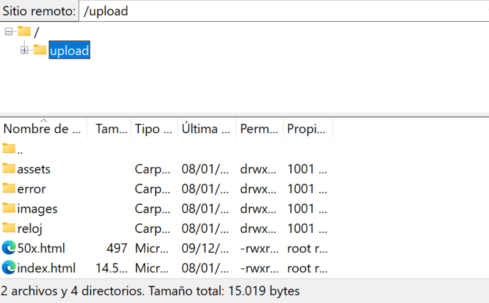

---

### Fase 3: Infraestructura Docker.

#### 7. Contenedores activos:
- **Qué demuestra:** Ambos contenedores (nginx-web y sftp-server) están en estado "Up" con los puertos correctamente mapeados.
- **Comando:** `docker compose ps`

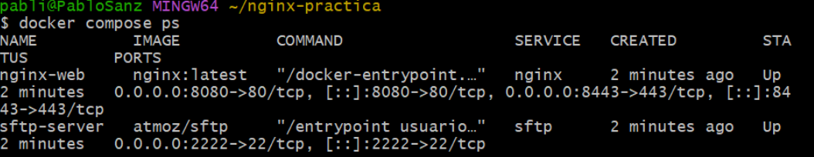

#### 8. Persistencia (Volumen compartido):
- **Qué demuestra:** El volumen `web-content` es compartido entre ambos servicios, permitiendo que los archivos subidos por SFTP sean servidos por Nginx.


#### 9. Despliegue multi-sitio:
- **Qué demuestra:** La aplicación del reloj funciona correctamente en la ruta `/reloj`, demostrando configuración multi-sitio por path.

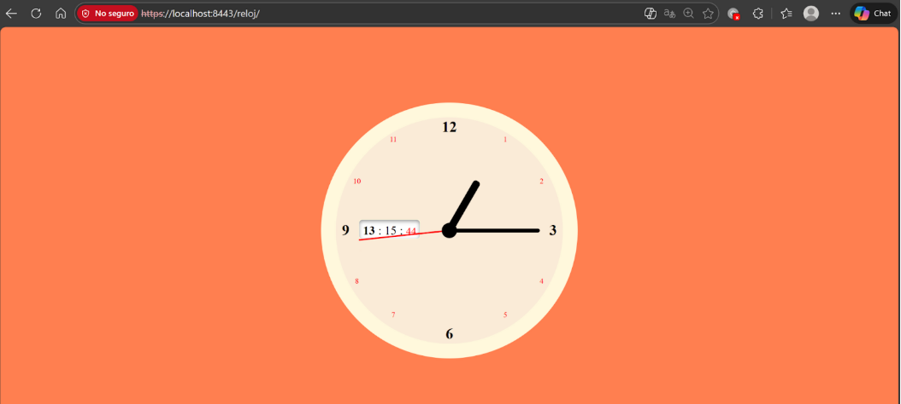

---

### Fase 4: Seguridad HTTPS.

**Pasos para generar los certificados SSL:**

1. Crear la carpeta para los certificados:
```bash
mkdir certs
```

2. Generar el certificado autofirmado:
```bash
openssl req -x509 -nodes -days 365 -newkey rsa:2048 \
  -keyout certs/nginx-selfsigned.key \
  -out certs/nginx-selfsigned.crt \
  -subj "/CN=localhost"
```

3. Actualizar el archivo `default.conf` con la configuración HTTPS:
```bash
cat > default.conf << 'EOF'
# Bloque 1: Redirección HTTP → HTTPS
server {
    listen 80;
    listen [::]:80;
    server_name localhost nombre_web;

    return 301 https://$host:8443$request_uri;
}

# Bloque 2: Servidor HTTPS
server {
    listen 443 ssl;
    listen [::]:443 ssl;
    server_name localhost nombre_web;

    ssl_certificate /etc/ssl/certs/nginx/nginx-selfsigned.crt;
    ssl_certificate_key /etc/ssl/certs/nginx/nginx-selfsigned.key;

    ssl_protocols TLSv1.2 TLSv1.3;
    ssl_prefer_server_ciphers on;
    ssl_ciphers ECDHE-ECDSA-AES128-GCM-SHA256:ECDHE-RSA-AES128-GCM-SHA256;

    root /usr/share/nginx/html;
    index index.html index.htm;

    access_log /var/log/nginx/access.log;
    error_log /var/log/nginx/error.log;

    location / {
        try_files $uri $uri/ =404;
    }

    location /reloj {
        alias /usr/share/nginx/html/reloj;
        index index.html;
        try_files $uri $uri/ =404;
    }
}
EOF
```

4. Reiniciar los contenedores para aplicar los cambios:
```bash
docker compose down
docker compose up -d
```

#### 10. Cifrado SSL:
- **Qué demuestra:** El servidor responde correctamente por HTTPS (puerto 8443) usando certificados SSL autofirmados.


#### 11. Redirección forzada:
- **Qué demuestra:** Las peticiones HTTP son redirigidas automáticamente a HTTPS con código 301 (Moved Permanently).

**Pasos para verificar la redirección:**
1. Abrir el navegador
2. Pulsar `F12` para abrir DevTools
3. Ir a la pestaña **Network**
4. Escribir en la barra de direcciones: `http://nombre_web:8080`
5. Observar que aparece una petición con Status **301**

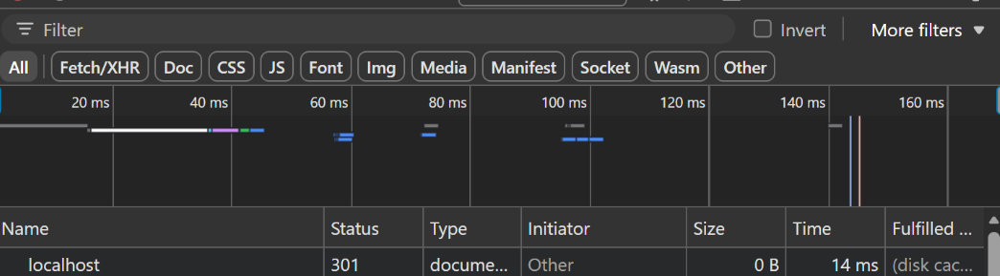

---

## Parte 2 — Evaluación RA2 (a–j).

### a) Parámetros de administración más importantes del servidor web:

**Comando para ver las directivas de nginx.conf:**
```bash
docker compose exec nginx sh -c "grep -nE 'worker_processes|worker_connections|access_log|error_log|gzip|include|keepalive_timeout' /etc/nginx/nginx.conf"
```

#### Directivas encontradas en `/etc/nginx/nginx.conf`:

```
3:worker_processes  auto;
5:error_log  /var/log/nginx/error.log notice;
10:    worker_connections  1024;
15:    include       /etc/nginx/mime.types;
22:    access_log  /var/log/nginx/access.log  main;
27:    keepalive_timeout  65;
29:    #gzip  on;
31:    include /etc/nginx/conf.d/*.conf;
```

#### Explicación de cada directiva:

| Directiva | Qué controla | Valor actual | Ejemplo de configuración incorrecta | Efecto del error |
|-----------|--------------|--------------|-------------------------------------|------------------|
| `worker_processes` | Número de procesos worker de Nginx | auto | `worker_processes 0;` | Nginx no arranca, error de configuración |
| `worker_connections` | Conexiones simultáneas por worker | 1024 | `worker_connections 1;` | Solo 1 cliente puede conectarse a la vez |
| `access_log` | Ruta del log de accesos | /var/log/nginx/access.log | `access_log /ruta/inexistente/access.log;` | Nginx no arranca por no poder escribir |
| `error_log` | Ruta del log de errores | /var/log/nginx/error.log | `error_log /dev/null;` | Se pierden todos los errores, imposible depurar |
| `keepalive_timeout` | Tiempo máximo de conexión keep-alive | 65 segundos | `keepalive_timeout 0;` | Cada petición abre nueva conexión TCP (ineficiente) |
| `include` | Incluye otros archivos de configuración | conf.d/*.conf | `include /archivo/que/no/existe;` | Nginx no arranca |
| `gzip` | Compresión de respuestas | off (comentado) | `gzip on;` sin `gzip_types` | Solo comprime text/html por defecto |

#### Cómo comprobar cada directiva:

- **worker_processes:** `docker compose exec nginx nginx -t` + revisar número de procesos con `ps aux`
- **worker_connections:** Test de carga con `ab` o `wrk`
- **access_log / error_log:** `docker compose logs nginx` o `tail -f` del archivo
- **keepalive_timeout:** `curl -v` y observar cabecera `Keep-Alive`
- **gzip:** `curl -I -H "Accept-Encoding: gzip"` y verificar `Content-Encoding: gzip`

#### Cambio aplicado: keepalive_timeout

Para modificar `keepalive_timeout` sin editar `nginx.conf` directamente, se puede añadir en el bloque `server` de `default.conf`:

```nginx
keepalive_timeout 30;
```

**Comandos para validar y recargar:**
```bash
docker compose exec nginx nginx -t
docker compose exec nginx nginx -s reload
```

**Evidencias:**

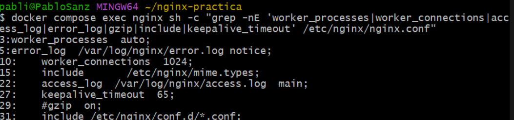
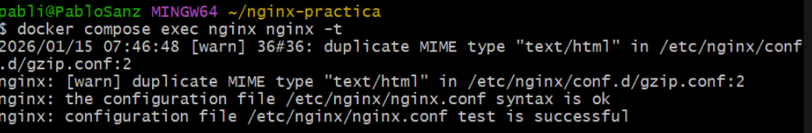
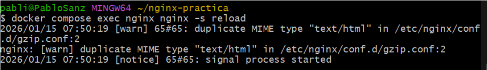

---

### b) Ampliación de funcionalidad mediante módulos.

#### Opción elegida: B1 — Gzip (compresión):

**Pasos para configurar Gzip:**

1. Crear el archivo `gzip.conf`:
```bash
cat > gzip.conf << 'EOF'
gzip on;
gzip_types text/plain text/html text/css application/json application/javascript text/xml application/xml;
gzip_comp_level 5;
gzip_vary on;
gzip_min_length 256;
EOF
```

2. Actualizar `docker-compose.yml` para montar el archivo:
```bash
cat > docker-compose.yml << 'EOF'
services:
  nginx:
    image: nginx:latest
    container_name: nginx-web
    ports:
      - "8080:80"
      - "8443:443"
    volumes:
      - web-content:/usr/share/nginx/html
      - ./default.conf:/etc/nginx/conf.d/default.conf
      - ./gzip.conf:/etc/nginx/conf.d/gzip.conf
      - ./certs:/etc/ssl/certs/nginx
    depends_on:
      - sftp
    restart: unless-stopped

  sftp:
    image: atmoz/sftp
    container_name: sftp-server
    ports:
      - "2222:22"
    volumes:
      - web-content:/home/usuario/upload
    command: usuario:password:1001
    restart: unless-stopped

volumes:
  web-content:
EOF
```

3. Reiniciar los contenedores:
```bash
docker compose down
docker compose up -d
```

4. Validar la configuración:
```bash
docker compose exec nginx nginx -t
docker compose exec nginx nginx -s reload
```

5. Crear un archivo grande para probar la compresión:
```bash
docker compose exec nginx sh -c "yes 'Linea de prueba para testing de compresion gzip en nginx' | head -2000 > /usr/share/nginx/html/largo.txt"
```

6. Verificar que gzip funciona:
```bash
curl -I -k -H "Accept-Encoding: gzip" https://localhost:8443/largo.txt
```

La respuesta debe incluir `Content-Encoding: gzip`.

#### Configuración aplicada (`gzip.conf`):

```nginx
gzip on;
gzip_types text/plain text/html text/css application/json application/javascript text/xml application/xml;
gzip_comp_level 5;
gzip_vary on;
gzip_min_length 256;
```

#### Explicación de cada directiva:

| Directiva | Función |
|-----------|---------|
| `gzip on` | Activa la compresión gzip |
| `gzip_types` | Tipos MIME a comprimir |
| `gzip_comp_level 5` | Nivel de compresión (1-9), 5 es buen balance |
| `gzip_vary on` | Añade cabecera Vary: Accept-Encoding |
| `gzip_min_length 256` | Solo comprime respuestas > 256 bytes |

**Evidencias:**

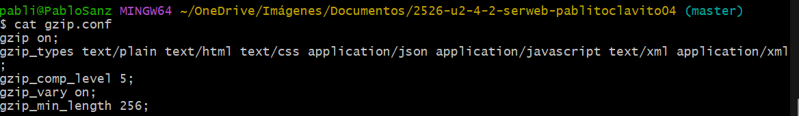
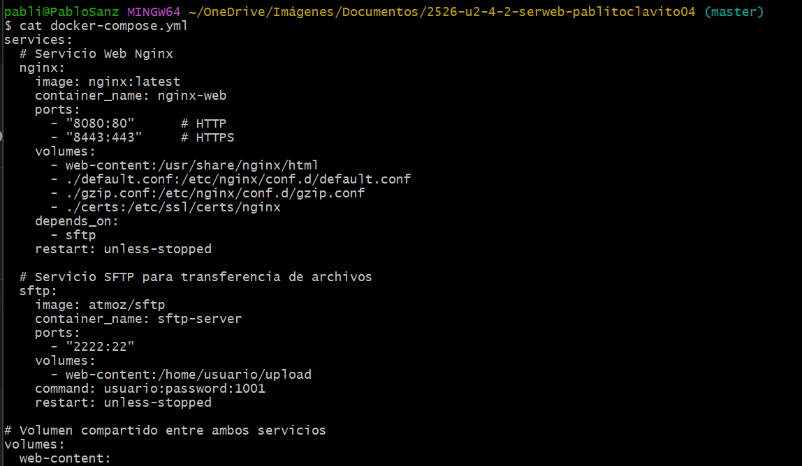
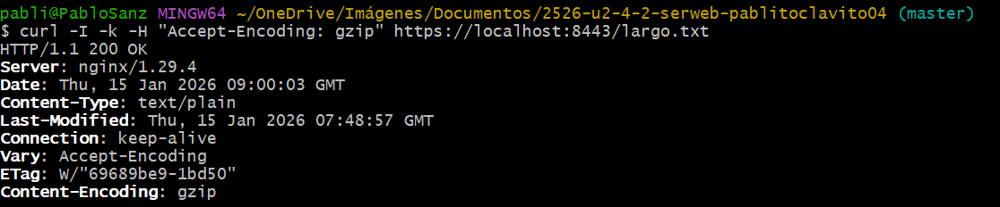

---

#### Módulo investigado: ngx_http_limit_req_module:

**Nombre:** ngx_http_limit_req_module

**Para qué sirve:** Este módulo permite limitar la tasa de peticiones procesadas por Nginx, útil para proteger contra ataques DDoS y abuso de la API. Funciona definiendo zonas de memoria compartida que rastrean las peticiones por IP o por otras claves.

**Cómo se instala/carga:**
- Viene **compilado por defecto** en Nginx, no requiere instalación adicional
- Se configura directamente en nginx.conf o en archivos incluidos
- Ejemplo de uso:

```nginx
http {
    limit_req_zone $binary_remote_addr zone=mylimit:10m rate=10r/s;
    
    server {
        location /api/ {
            limit_req zone=mylimit burst=20 nodelay;
        }
    }
}
```

**Fuente(s):**
- Documentación oficial de Nginx: [https://nginx.org/en/docs/http/ngx_http_limit_req_module.html](https://nginx.org/en/docs/http/ngx_http_limit_req_module.html)

---

### c) Creación y configuración de sitios virtuales / multi-sitio.

#### Evidencia del multi-sitio por path:

- **Web principal** en `/` → Plantilla Dimension
- **Web secundaria** en `/reloj` → Aplicación de reloj

#### Diferencia entre multi-sitio por path y por nombre:

| Característica | Por path (location) | Por nombre (server_name) |
|----------------|---------------------|--------------------------|
| URL de acceso | `ejemplo.com/app1`, `ejemplo.com/app2` | `app1.ejemplo.com`, `app2.ejemplo.com` |
| Configuración | Múltiples `location` en un `server` | Múltiples bloques `server` |
| Certificado SSL | Un solo certificado para el dominio | Certificado wildcard o uno por subdominio |
| Caso de uso | Apps relacionadas bajo mismo dominio | Apps independientes con identidad propia |

**Multi-sitio por path:** Usa directivas `location` dentro de un mismo bloque `server`. Las aplicaciones comparten el mismo nombre de dominio pero se acceden por rutas diferentes.

**Multi-sitio por nombre:** Usa múltiples bloques `server` con diferentes `server_name`. Cada aplicación tiene su propio subdominio o dominio.

#### Otros tipos de multi-sitio:

1. **Por puerto:** Diferentes aplicaciones escuchan en diferentes puertos (ej: 8080, 8081). Útil para desarrollo pero no recomendado en producción.

2. **Por IP:** Si el servidor tiene múltiples IPs, cada `server` puede escuchar en una IP diferente usando `listen IP:puerto`. Usado en hosting compartido tradicional.

#### Configuración activa (`default.conf`):

**Comando para ver la configuración dentro del contenedor:**
```bash
docker compose exec nginx cat //etc/nginx/conf.d/default.conf
```

```nginx
# Bloque servidor HTTPS
server {
    listen 443 ssl;
    server_name localhost nombre_web;
    
    root /usr/share/nginx/html;
    index index.html index.htm;
    
    # Ubicación principal
    location / {
        try_files $uri $uri/ =404;
    }
    
    # Ubicación del reloj (multi-sitio por path)
    location /reloj {
        alias /usr/share/nginx/html/reloj;
        index index.html;
        try_files $uri $uri/ =404;
    }
}
```

**Directivas clave:**
- `root`: Define el directorio raíz para servir archivos
- `location /`: Maneja peticiones a la raíz
- `location /reloj`: Usa `alias` para mapear la ruta a un directorio diferente
- `try_files`: Intenta servir el archivo, luego directorio, o devuelve 404

**Evidencias:**


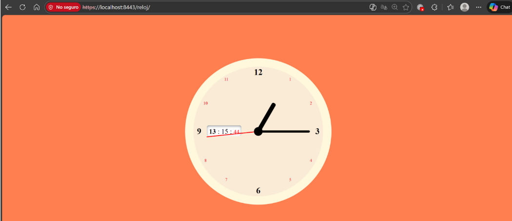
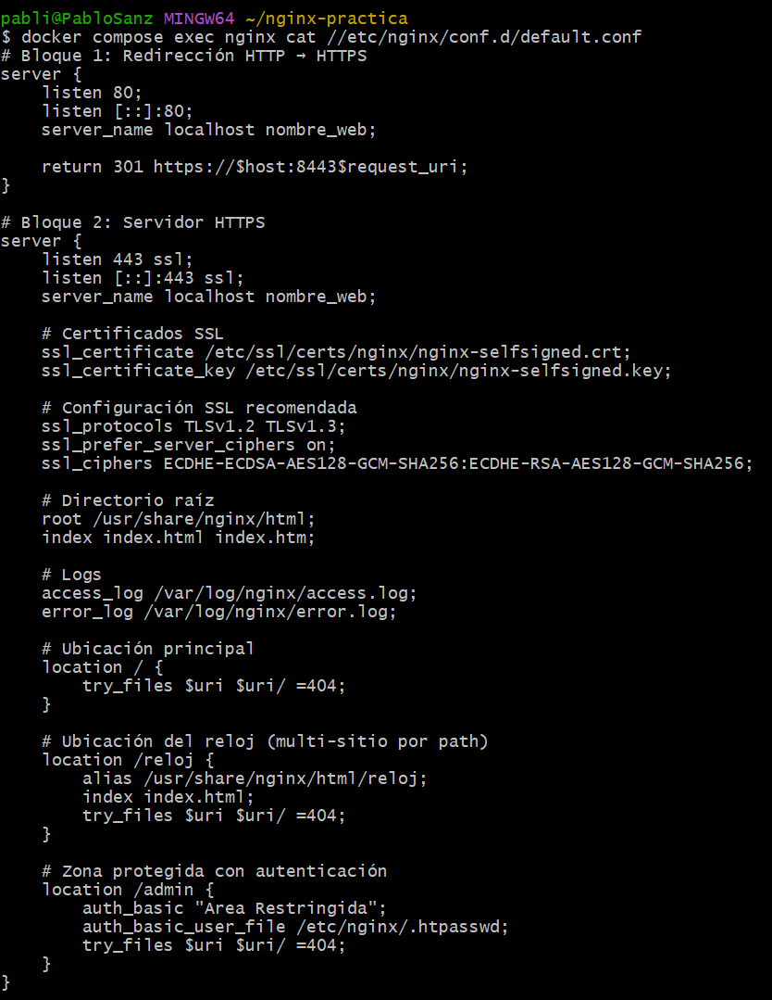

---

### d) Autenticación y control de acceso.

**Pasos para configurar la autenticación en /admin:**

1. Entrar al contenedor de Nginx:
```bash
docker compose exec nginx sh
```

2. Dentro del contenedor, crear el archivo `.htpasswd`:
```sh
echo "admin:$(openssl passwd -apr1 Admin1234)" > /etc/nginx/.htpasswd
cat /etc/nginx/.htpasswd
exit
```

3. Crear el contenido para `/admin`:
```bash
docker compose exec nginx sh
```
Dentro del contenedor:
```sh
mkdir -p /usr/share/nginx/html/admin
echo '<h1>Panel de Administracion</h1><p>Acceso restringido</p>' > /usr/share/nginx/html/admin/index.html
exit
```

4. Actualizar `default.conf` añadiendo el location /admin:
```bash
cat > default.conf << 'EOF'
# Bloque 1: Redirección HTTP → HTTPS
server {
    listen 80;
    listen [::]:80;
    server_name localhost nombre_web;

    return 301 https://$host:8443$request_uri;
}

# Bloque 2: Servidor HTTPS
server {
    listen 443 ssl;
    listen [::]:443 ssl;
    server_name localhost nombre_web;

    ssl_certificate /etc/ssl/certs/nginx/nginx-selfsigned.crt;
    ssl_certificate_key /etc/ssl/certs/nginx/nginx-selfsigned.key;

    ssl_protocols TLSv1.2 TLSv1.3;
    ssl_prefer_server_ciphers on;
    ssl_ciphers ECDHE-ECDSA-AES128-GCM-SHA256:ECDHE-RSA-AES128-GCM-SHA256;

    root /usr/share/nginx/html;
    index index.html index.htm;

    access_log /var/log/nginx/access.log;
    error_log /var/log/nginx/error.log;

    location / {
        try_files $uri $uri/ =404;
    }

    location /reloj {
        alias /usr/share/nginx/html/reloj;
        index index.html;
        try_files $uri $uri/ =404;
    }

    location /admin {
        auth_basic "Area Restringida";
        auth_basic_user_file /etc/nginx/.htpasswd;
        try_files $uri $uri/ =404;
    }
}
EOF
```

5. Recargar la configuración:
```bash
docker compose exec nginx nginx -t
docker compose exec nginx nginx -s reload
```

6. Probar la autenticación:
```bash
# Sin credenciales (debe dar 401)
curl -I -k https://localhost:8443/admin/

# Con credenciales (debe dar 200)
curl -I -k -u admin:Admin1234 https://localhost:8443/admin/
```

#### Configuración en `default.conf`:

```nginx
location /admin {
    auth_basic "Area Restringida";
    auth_basic_user_file /etc/nginx/.htpasswd;
    try_files $uri $uri/ =404;
}
```

**Evidencias:**

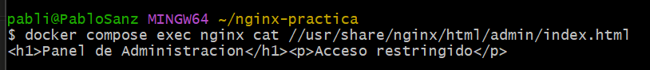
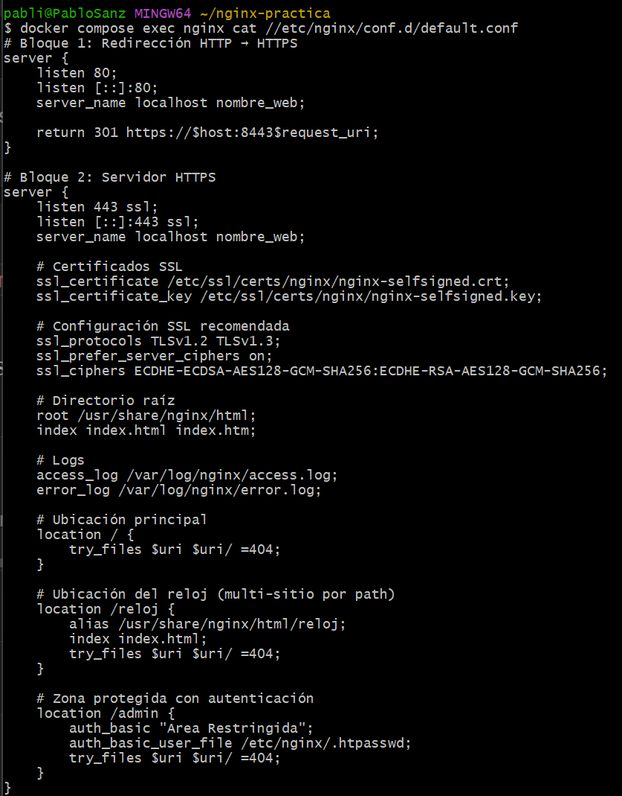
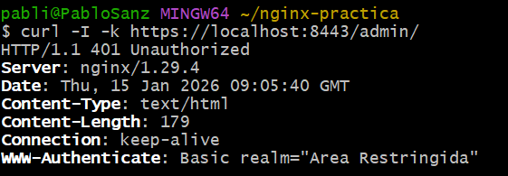
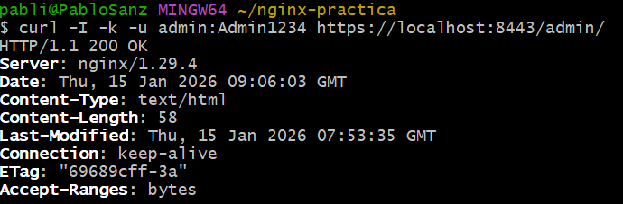

---

### e) Obtención e instalación de certificados digitales.

#### ¿Qué es `.crt` y `.key`?

| Archivo | Contenido | Propósito |
|---------|-----------|-----------|
| `.crt` (certificado) | Clave pública + información del titular | Se envía al cliente para establecer conexión segura |
| `.key` (clave privada) | Clave privada del servidor | Descifra la comunicación, debe mantenerse secreta |

#### ¿Por qué se usa `-nodes` en laboratorio?

El parámetro `-nodes` (no DES) genera la clave privada **sin cifrado con contraseña**. 

**En laboratorio:** Es práctico porque Nginx puede leer la clave sin pedir contraseña al arrancar.

**En producción:** Se recomienda cifrar la clave y usar mecanismos seguros para proporcionar la contraseña al servidor.

#### Generación del certificado autofirmado:

```bash
openssl req -x509 -nodes -days 365 -newkey rsa:2048 \
  -keyout certs/nginx-selfsigned.key \
  -out certs/nginx-selfsigned.crt \
  -subj "/CN=localhost"
```

#### Archivos generados:

**Comando para verificar:**
```bash
ls -l certs/
```

```
certs/
├── nginx-selfsigned.crt  (1266 bytes)
└── nginx-selfsigned.key  (1732 bytes)
```

#### Montaje en docker-compose.yml:

```yaml
volumes:
  - ./certs:/etc/ssl/certs/nginx
```

#### Uso en default.conf:

```nginx
ssl_certificate /etc/ssl/certs/nginx/nginx-selfsigned.crt;
ssl_certificate_key /etc/ssl/certs/nginx/nginx-selfsigned.key;
```

**Evidencias:**

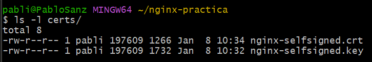
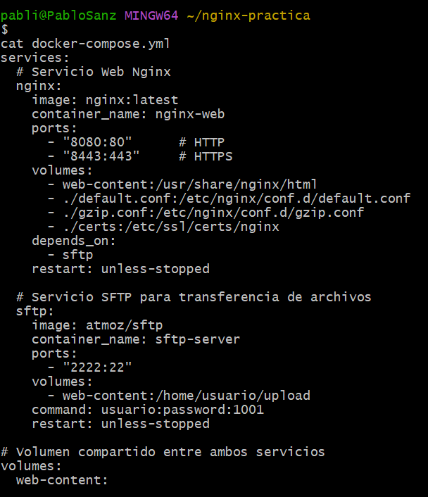
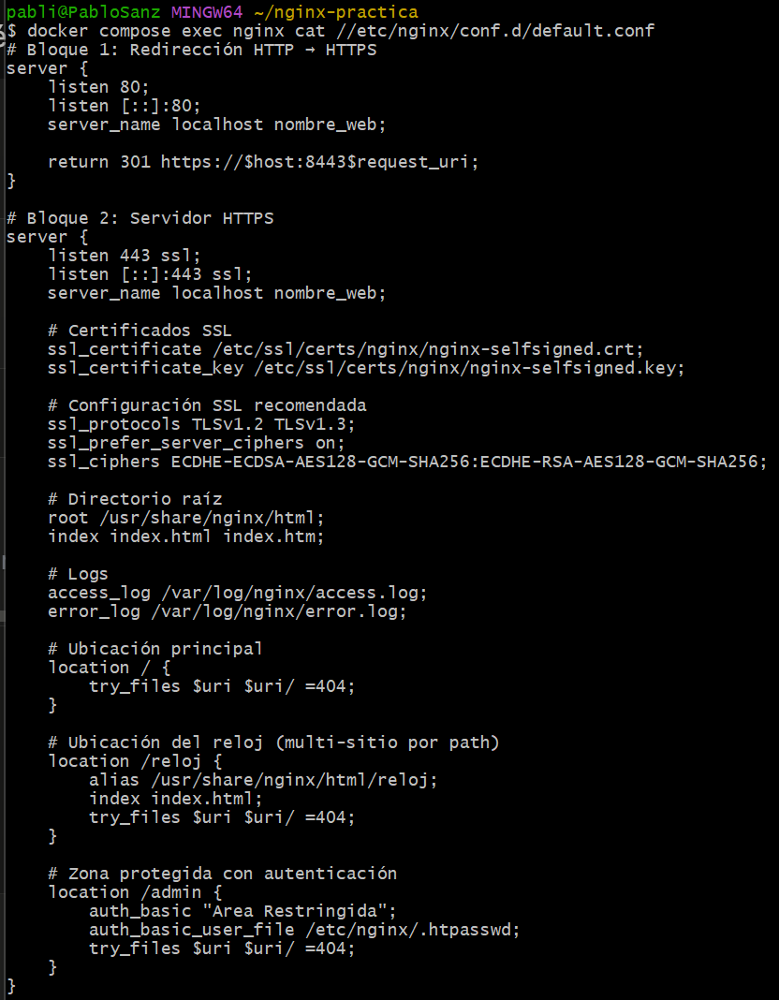

---

### f) Asegurar comunicaciones cliente-servidor

#### HTTPS operativo

El servidor escucha en el puerto 443 (mapeado a 8443) con SSL/TLS habilitado.

Configuración SSL aplicada:
```nginx
ssl_protocols TLSv1.2 TLSv1.3;
ssl_prefer_server_ciphers on;
ssl_ciphers ECDHE-ECDSA-AES128-GCM-SHA256:ECDHE-RSA-AES128-GCM-SHA256;
```

#### Redirección HTTP → HTTPS

Todas las peticiones al puerto 80 son redirigidas al 443 con código 301.

#### ¿Por qué dos bloques server?

| Bloque | Puerto | Función |
|--------|--------|---------|
| Primero (HTTP) | 80 | Captura tráfico no cifrado y redirige a HTTPS |
| Segundo (HTTPS) | 443 | Sirve contenido de forma segura |

**Razones:**
1. **Seguridad:** Garantiza que todo el tráfico esté cifrado
2. **SEO:** El código 301 indica a buscadores que la URL canónica es HTTPS
3. **Compatibilidad:** Usuarios que escriben `http://` son redirigidos automáticamente

```nginx
# Bloque 1: Redirección
server {
    listen 80;
    return 301 https://$host:8443$request_uri;
}

# Bloque 2: Contenido HTTPS
server {
    listen 443 ssl;
    # ... configuración SSL y contenido
}
```

**Evidencias:**


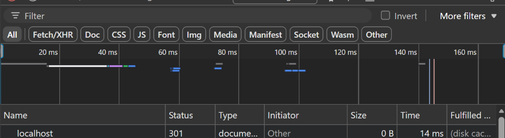

---

### g) Documentación

Este documento (`DESPLIEGUE.md`) constituye la documentación completa del proyecto, incluyendo:

- **Arquitectura:** Servicios, puertos, volúmenes
- **Configuración Nginx:** Ubicación de archivos, server blocks, directivas
- **Seguridad:** Certificados SSL, redirección HTTPS, autenticación
- **Logs:** Monitorización y análisis
- **Evidencias:** Capturas enlazadas para cada apartado
- **Pasos detallados:** Comandos y procedimientos para reproducir la infraestructura

---

### h) Ajustes necesarios para implantación de aplicaciones en Nginx

#### Desplegar una segunda app en `/reloj`

**Consideraciones:**

1. **Rutas relativas vs absolutas:**
   - La app del reloj usa rutas relativas (`style.css`, `script.js`)
   - Esto funciona porque el navegador las resuelve respecto a `/reloj/`
   - Si usara rutas absolutas (`/style.css`), fallaría porque buscaría en la raíz

2. **Uso de `alias` vs `root`:**
   - `alias /usr/share/nginx/html/reloj;` mapea `/reloj` directamente al directorio
   - Con `root`, la ruta sería `/usr/share/nginx/html/reloj/reloj` (duplicada)

#### Problema típico de permisos SFTP

**Problema:** Al subir archivos por SFTP, pueden quedar con permisos restrictivos (ej: 600) o propietario incorrecto, impidiendo que Nginx los lea.

**Síntomas:** Error 403 Forbidden o archivos no visibles.

**Solución aplicada:**
1. El usuario SFTP se crea con UID 1001: `usuario:password:1001`
2. Los archivos subidos pertenecen a este UID
3. Nginx (corriendo como root o www-data) puede leerlos

**Alternativas:**
- Ajustar umask del servidor SFTP
- Usar `chmod 644` después de subir
- Configurar ACLs en el sistema de archivos

**Evidencias:**


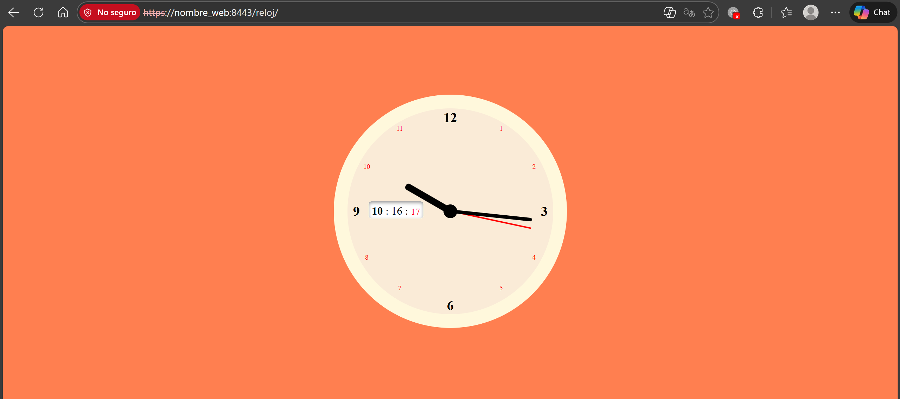

---

### i) Virtualización en despliegue (contenedores)

#### Diferencia: Instalación nativa vs Contenedor

| Aspecto | Instalación nativa | Contenedor Docker |
|---------|-------------------|-------------------|
| **Instalación** | `apt install nginx` en el SO | `docker pull nginx` |
| **Configuración** | Editar `/etc/nginx/nginx.conf` directamente | Montar archivos por volumen |
| **Persistencia** | Configuración persiste en disco | Contenedor efímero, config externa |
| **Aislamiento** | Comparte recursos del SO | Aislado del host |
| **Portabilidad** | Dependiente del SO | Funciona igual en cualquier host con Docker |
| **Escalabilidad** | Manual, compleja | `docker compose up --scale nginx=3` |
| **Actualizaciones** | `apt upgrade`, puede romper config | Cambiar tag de imagen, config intacta |
| **Recuperación** | Reinstalar + restaurar backups | `docker compose up` recrea todo |

#### Ventajas del enfoque con contenedores:

1. **Reproducibilidad:** El mismo `docker-compose.yml` funciona en cualquier máquina
2. **Versionado:** Configuración en Git, fácil rollback
3. **Desarrollo local:** Entorno idéntico a producción
4. **Microservicios:** Cada servicio aislado y escalable independientemente

**Comando para ver los contenedores:**
```bash
docker compose ps
```

**Evidencia:**


---

### j) Logs: monitorización, consolidación y análisis

#### Ubicación de logs en Docker

En la imagen oficial de Nginx para Docker, los logs están redirigidos a stdout/stderr:
```
access.log -> /dev/stdout
error.log -> /dev/stderr
```

Esto permite usar `docker compose logs` para verlos.

#### Monitorización en tiempo real

```bash
docker compose logs -f nginx
```

#### Pasos para generar tráfico y analizar logs:

1. Generar tráfico normal (20 peticiones):
```bash
for i in $(seq 1 20); do curl -s -o /dev/null -k https://localhost:8443/; done
```

2. Generar errores 404 (10 peticiones):
```bash
for i in $(seq 1 10); do curl -s -o /dev/null -k https://localhost:8443/no-existe-$i; done
```

3. Ver los logs recientes:
```bash
docker compose logs nginx --tail 30
```

4. Extraer métricas - Top URLs solicitadas:
```bash
docker compose logs nginx --no-log-prefix 2>/dev/null | grep "HTTP/1.1" | awk '{print $7}' | sort | uniq -c | sort -nr | head
```

5. Extraer métricas - Códigos de respuesta:
```bash
docker compose logs nginx --no-log-prefix 2>/dev/null | grep "HTTP/1.1" | awk '{print $9}' | sort | uniq -c | sort -nr | head
```

6. Extraer métricas - URLs con error 404:
```bash
docker compose logs nginx --no-log-prefix 2>/dev/null | grep "HTTP/1.1" | awk '$9==404 {print $7}' | sort | uniq -c | sort -nr | head
```

#### Métricas extraídas

**Top URLs solicitadas:**
```
21 /
 4 /admin/
 2 /largo.txt
 1 /reloj/
 1 /no-existe-9
...
```

**Códigos de respuesta:**
```
24 200
11 404
 3 401
 1 301
```

**URLs con error 404:**
```
1 /no-existe-9
1 /no-existe-8
...
```

**Evidencias:**

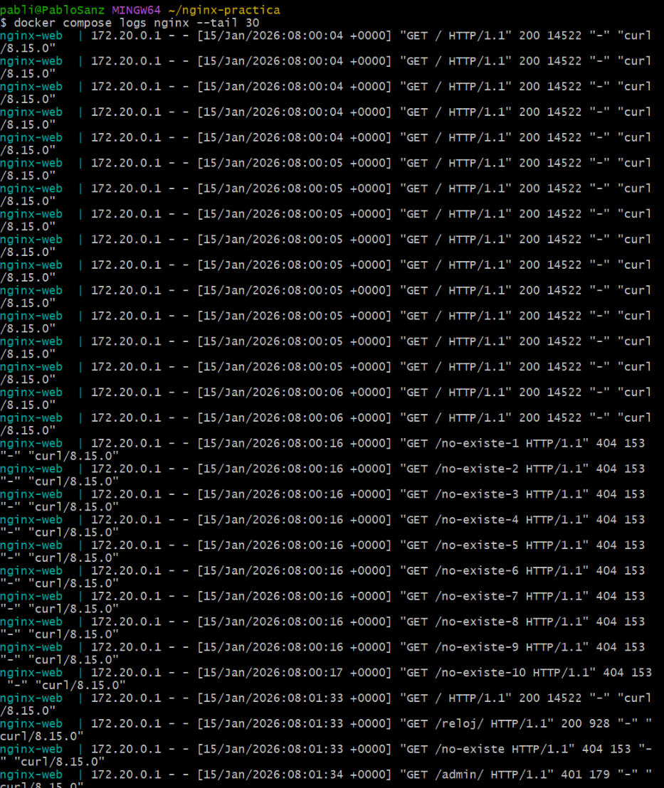
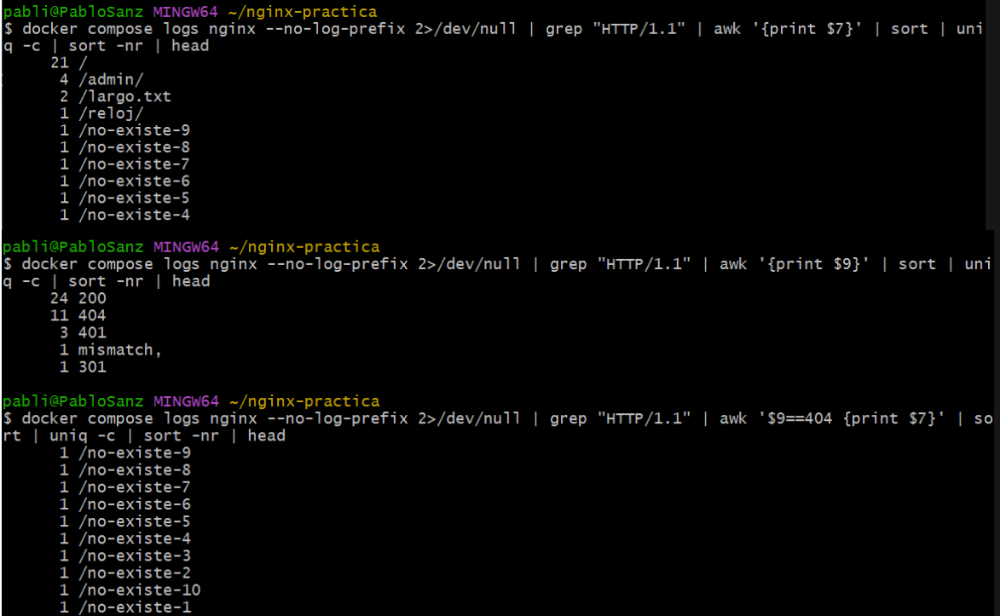

---
